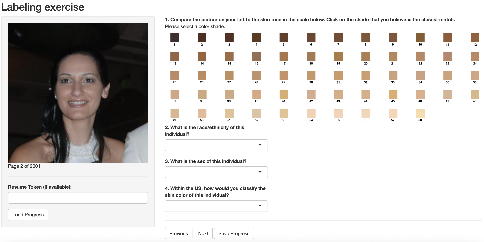

# Shiny Apps Gallery

A hub for my interactive apps. Click on the 'Open App' button to launch the app.

## Apps
### 1) An app with clickable images

  
This app inputs a random sample of images from the fairface dataset (https://github.com/joojs/fairface) and asks demographic information about the subjects in the pictures. This app is intended to create labels of skin tone, gender, and race to feed a ML model.  

### 2) An app with clickable images (Alternative scale) 
)

This app inputs a random sample of images from the fairface dataset (https://github.com/joojs/fairface) and asks demographic information about the subjects in the pictures. This app is intended to create labels of skin tone, gender, and race to feed a ML model.

